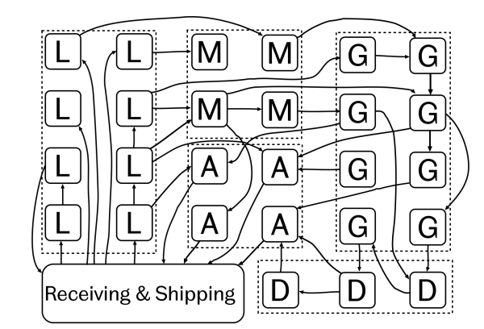

# FAMS - Flexible Automated Manufacturing System

The overall aim of FAMS is to completely automate the production of products that are typically manufactured in a process layout 
## << **_Work In Progress_** >>

_Fig 1. A process layout_

This project is built using **ROS2 Humble** 

## Installation
Clone the `src` folder into a new ROS workspace and build using `colcon build --symlink-install`
